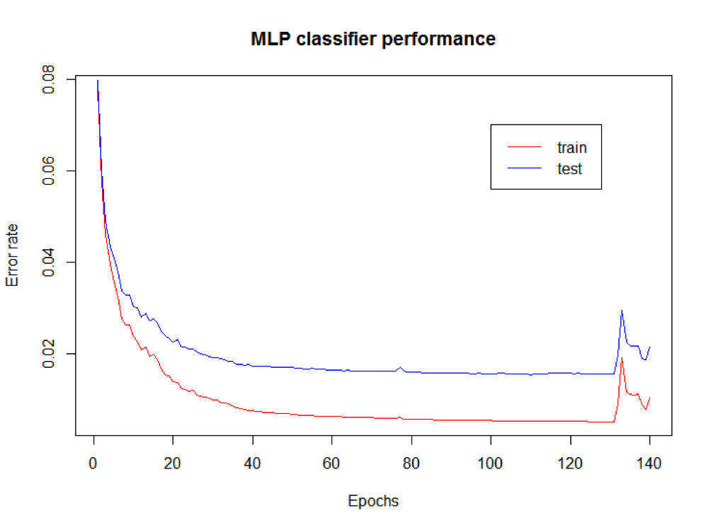

# PatternRecognition2016
Team Project for the Course Pattern Recognition in Unifr 

=======
## Test Results
The test results can be found in the results folder directly in the root of the project folder structure.

=======
## SVM
The testing results of the experiments for the SVM can be found in the folder svm
The files FinalResult_kernel.txt are containing the result for classifing the whole testset with the training set with the best c and gamma value.
The Files Result_kernel_numberOfFolder_numberOfInstances.txt are containing the cross-validation results.

The result of the experiments for the MLP can be found in the folder mlp.

<<<<<<< HEAD
=======
Datapoint.java:
Class to represent a datapoint 

FeatureExtraction.java.
Class to extract some feature to reduce the amount of data.
I implemented for the image a reducing which calculates for every column
in the image the average grey value, the upper most pixel, the lower most pixel
and the number of black-white transitions.
For the MINST dataset this reduced the vector to 4*28 = 112 features

IO_Functions:
Class to read and write to files.

SVM:
Class for the svm classifer. 

LauncherMLP.java
Class to call all the functions for optimization the best parameters (epochs, learning rate and random weights initialization) and test experiments. The results of the experiments are in the mlp/experiments folder.

MLP.java
Class for building, training and evaluating the MLP. The evaluation is performed against a given test set.
The learningRate is the c parameter of the algorithm seen in class. 
The hiddenLayer is a string with a comma separated list of numbers; each number represents the number of nodes of a distinct hidden layer. E.g., "10,40,10" creates a network with 3 hidden layers respectively composed by 10, 40 and 10 nodes.
Epochs are the number of training epochs.
Train is the train data set.
Test is the test data set.
The error rate of the evaluation against the test set.

The best parameters are:
* Learning rate: 0.1
* Epochs: 110
* hidden layers: 80
* Random initialization: 4

Experiments on the test set:
**Accuracy: 98.3%**

MLPResult.java
Class to store the result of an MLP training and evaluation.
It stores the following:
* errorRate: the error rate of the evaluation
* summary: a summary string of the evaluation
* model: the MLP model created by the training
	
MultilayerPerceptonCustom.java
Multi-layer perceptron neural networks implementation in java.

The error-rate on the training and the validation set with respect to the
training epochs:

>>>>>>> origin/master

=======
## Signature Verification
SignatureVerificationData contains enrollment and validation sets for testing as well as TestSignatures from the final test set. 

###### src/signatures
* GroundTruth.java to represent the groundTruth given in the first set of signatures. 
* Signature.java implements DTWFeatureVector and represents a signature with user, number and a list of FtVectors
* SignatureFeature.java implements FtVector and contains the features t,x,y,pressure,penup,azimuth,inclination,vx,vy
* SignatureLoader.java loads all the data from the files into lists of the selected type
* SignatureResult.java stores the results after computing DTW
* SignatureResultComparator.java implements Comparator and compares the two distance double values in the SignatureResult and is used to order the list so that the most similar signature is listed first
* SignatureVerification.java loads the data using loader and then computes DTW, stores it in result classes and runs evaluation which then is written to the results file

###### Run Signature Verification
To run signature verification start main/MainSignatureVerification.java

